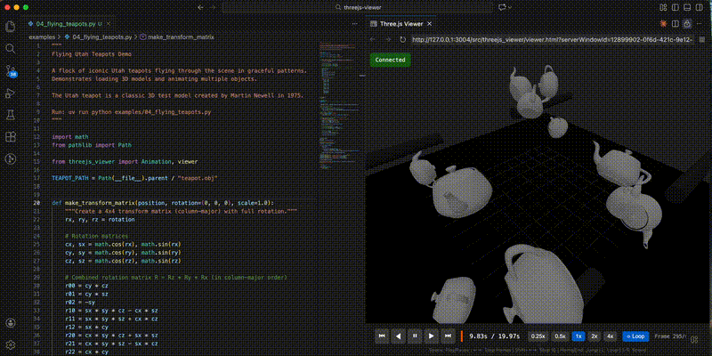

# threejs-viewer

Lightweight Three.js viewer controlled from Python via WebSocket.



A Python client runs a WebSocket server that a browser-based Three.js viewer connects to. Designed for robotics visualization, scientific computing, and interactive 3D exploration.

## Features

- **Simple API**: Add primitives, load models, update transforms
- **GLB/PBR support**: Load GLB models with PBR materials, studio environment lighting
- **Embedded animations**: Drive GLTF skeletal/morph animations from Python via `clip_times`
- **Animation support**: Pre-compute animations, scrub timeline, adjust playback speed
- **Binary transfer**: Efficient loading of large meshes and polylines
- **Auto-reconnect**: Browser reconnects automatically, animations persist
- **Z-up coordinates**: Robotics convention (matches ROS, URDF)
- **No build step**: Self-contained HTML viewer, just open in browser

## Installation

```bash
pip install threejs-viewer
```

## Quick Start

```python
from threejs_viewer import viewer

# Start server and wait for browser to connect
v = viewer()

# Add objects
v.add_sphere("ball", radius=0.3, color=0xFF0000, position=[0, 0, 0.5])
v.add_box("ground", width=5, height=5, depth=0.1, color=0x444444)

# Keep running
input("Press Enter to exit")
```

Open the viewer in your browser:

```bash
threejs-viewer open
# Or: threejs-viewer path  (prints path to viewer.html)
```

## Usage

### Objects

```python
# Primitives
client.add_box("box1", width=1, height=2, depth=0.5, color=0x4A90D9)
client.add_sphere("sphere1", radius=0.5, position=[2, 0, 0])
client.add_cylinder("cyl1", radius_top=0.3, radius_bottom=0.5, height=1)

# 3D models (binary transfer)
client.add_model_binary("robot", "robot.stl", format="stl")

# Polylines with colormaps
client.add_polyline("path", points, colors=z_values, colormap="viridis", line_width=3)
```

### Transforms

```python
# Single object
client.set_position("box1", 1.0, 2.0, 0.5)
client.set_matrix("box1", matrix_4x4.flatten().tolist())

# Batch update (efficient for 60fps)
client.set_transforms({
    "link1": matrix1.flatten().tolist(),
    "link2": matrix2.flatten().tolist(),
})
```

### Animations

```python
from threejs_viewer import Animation

animation = Animation(loop=True)
for t in times:
    animation.add_frame(
        time=t,
        transforms=compute_transforms(t),
        colors={"robot": 0xFF0000 if collision else 0x00FF00},
        clip_times={"glb_model": t},  # drive embedded GLTF animations
    )
animation.add_marker(3.5, "Collision detected")

client.load_animation(animation)
```

Viewer controls: Space (play/pause), Arrow keys (step frames), 1-5 (speed), L (loop)

### Binary Channels (Large Animations)

For animations with many objects or frames, use binary channels instead of Frame dicts for much faster serialization and transfer:

```python
import numpy as np
from threejs_viewer import Animation

animation = Animation(loop=True)
animation.set_frame_times(np.arange(n_frames) / 60.0)

# Transforms: (n_frames, n_objects, 16) float32
animation.set_transform_data(object_ids, transform_array)

# Draw ranges: (n_frames, n_objects) float32
animation.set_draw_range_data(object_ids, draw_range_array)

# Colors with indexed colormap: (n_frames, n_objects) uint8
animation.add_channel("colors", object_ids, color_indices, dtype="uint8",
                       metadata={"colormap": [0x44AA44, 0xFF3333]})

# Visibility: (n_frames, n_objects) uint8 (0=hidden, 1=visible)
animation.add_channel("visibility", object_ids, vis_data, dtype="uint8")

client.load_animation(animation)
```

Binary channels and Frame-based JSON can be mixed (e.g. binary transforms + JSON `clip_times`).

### GLB Models with Embedded Animations

```python
# Load a GLB with embedded animations (skeletal, morph targets)
client.add_model_binary("fox", "fox.glb", format="glb")

# Seek embedded animation to a specific time (seconds)
client.set_clip_time("fox", 1.5)
```

## Documentation

- [DESIGN.md](DESIGN.md) - Architecture and protocol details
- [examples/](examples/) - Runnable demo scripts

## CLI

```bash
threejs-viewer path    # Print path to viewer.html
threejs-viewer open    # Open in default browser
threejs-viewer code    # Open in VS Code (use "Show Preview" for docked view)
```

## License

MIT
